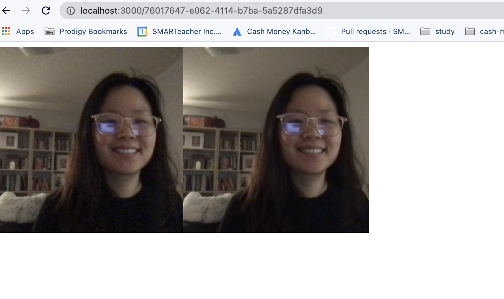

# Zoom Clone Video chat app with Socket.io and PeerJS

tutorial: https://www.youtube.com/watch?v=DvlyzDZDEq4&t=867s&ab_channel=WebDevSimplified

> Cannot be deployed to Heroku without SSL https://developer.mozilla.org/en-US/docs/Web/API/MediaDevices/getUserMedia#privacy_and_security

## Setup

1. Clone repository and install dependencies

```
npm i
npm start
```

2. Navigate to http://localhost:3000, should be immediately redirected to a new room.

3. In another browser window, navigate to the exact from from the first window.

On connecting to a new user, will see the video update in both screens. When disconnecting the video disappears.


